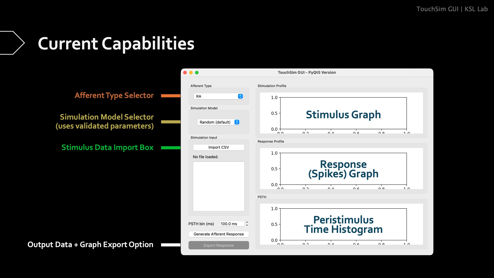

# TouchSim GUI
TouchSim GUI is a graphical user interface for peripheral tactile response simulation, made specifically for the TouchSim model from [Saal, Delhaye et al., PNAS, 2017](https://doi.org/10.1073/pnas.1704856114). The current version is developed by Chen Bo-Yu at [**KSL Lab**](https://www.google.com/url?sa=t&source=web&rct=j&opi=89978449&url=https://kuoshenglee.wixsite.com/ksllab&ved=2ahUKEwjIz-ec9u-RAxWI2jQHHWL7AW4QFnoECAwQAQ&usg=AOvVaw2Wl8vIm0ZGc1up54-5yz7P). 

The aim of TouchSim GUI is, aside from enhancing the accessibility of the TouchSim models, to enable the application of TouchSim onto interoception simulations in addition to exteroception. Currently, the GUI only supports Single-Afferent simulations using imported stimulus data in the form of csv files. More functionalities to be added progressively. Pull requests to amend functionalities (especially for Afferent-Population simulations) are welcome.

The GUI is based on *PyQt5* and is compatible for both Windows and MacOS systems. Note that the core of this GUI, **touchsim**, requires Python 3.6 or higher to run. It also requires *numpy*, *scipy*, *skikit-image*, *numba*, and *matplotlib*.

## Installation
**!!! Ensure that Anaconda or Miniconda is installed before proceeding.**

### Windows
> Tested on Windows 11 Version 25H2.

**Option 1: Automatic Setup (Recommended)**

Double-click `TouchSimGUI.bat` in the project folder. The script will:
- Detect your Conda installation automatically
- Create the `tsgui` environment from `environment.yml`
- Activate the environment
- Launch the GUI

**Option 2: Manual Setup**

1. Open Anaconda Prompt or PowerShell
2. Navigate to the project folder:
   ```
   cd path\to\touchsimGUI
   ```
3. Create the environment from `environment.yml`:
   ```
   conda env create -f environment.yml
   ```
4. Activate the environment:
   ```
   conda activate tsgui
   ```
5. Run the GUI:
   ```
   python touchsim_gui.py
   ```

### MacOS

> Tested on MacOS Tahoe 26.2 (25C56).

1. Open Terminal
2. Navigate to the project folder:
   ```
   cd path/to/touchsimGUI
   ```
3. Create the environment from `environment.yml`:
   ```
   conda env create -f environment.yml
   ```
4. Activate the environment:
   ```
   conda activate tsgui
   ```
5. Run the GUI:
   ```
   python touchsim_gui.py
   ```

## Using the GUI

*Note: Figure updated 4 Jan 2026.*

### GUI Components Guide

**Left Panel - Controls and Settings**

1. **Afferent Type**
   - Select an afferent type to simulate: PC (Pacinian), RA (Rapidly Adapting), or SA1 (Slowly Adapting)

2. **Simulation Model**
   - Choose a specific model variant for the selected afferent type
   - The available models update automatically based on your afferent selection
   - Leave as default for random model selection

3. **Stimulation Input**
   - **Import CSV**: Load stimulus data from CSV file(s) with required columns: `time` and `amplitude`
   - **File List**: Displays all loaded stimulus files; select one to preview its stimulation profile
   - Multiple CSV files can be loaded and processed together
   - Units: Time - seconds, Amplitude - mm
   
   *Note that there is no way to remove or modify imported files yet. Close and restart the program if you wish to make changes to your file choices.*

4. **PSTH Bin Size** (ms)
   - Adjusts the time resolution for the Post-Stimulus Time Histogram (PSTH)
   - Smaller values (e.g., 1 ms) provide finer temporal resolution; larger values smooth the data
   - You must click **[Generate Afferent Response]** again to generate new results after each change of PSTH bin size.
   - Default: 100 ms

5. **Generate Afferent Response**
   - Runs the TouchSim simulation on all loaded stimulus files using the selected afferent type and model
   - Generates neural spike responses and calculates PSTH statistics
   - Results appear in the plotting panels on the right

6. **Export Response**
   - Saves simulation results as CSV files and a PDF report containing:
     - Spike series data (raw spike timestamps)
     - PSTH data with average spike density across all stimuli
     - Spike raster plot
     - Individual and combined PSTH plots

**Right Panel - Plotting Panels**

1. **Stimulation Profile**
   - Displays the selected stimulus over time (amplitude vs. time)
   - Shows the input signal sent to the simulated afferent
   - Updates when you select a different CSV file from the list

2. **Response Profile**
   - Shows the simulated neural response as a spike raster plot
   - Each horizontal line represents one afferent neuron; dots indicate spike times
   - Displays response patterns for all loaded stimuli simultaneously

3. **PSTH (Post-Stimulus Time Histogram)**
   - Histogram showing spike count (or firing rate) over time bins
   - The bin size is controlled by the "PSTH bin" field on the left
   - When a single stimulus is selected: shows PSTH for that stimulus
   - When response is generated: shows combined PSTH across all stimuli

### Typical Workflow

1. Load stimulus CSV file(s) using **Import CSV**
2. Select desired **Afferent Type** and **Simulation Model**
3. Adjust **PSTH Bin Size** if desired
4. Click **Generate Afferent Response** to simulate
5. Review the **Response Profile** and **PSTH** plots
6. Click **Export Response** to save results

---
*Information below is provided by TouchSim developers. These online tutorials are most efficient for learning basic TouchSim operations.*

# TouchSim
A Python implementation of the TouchSim model to simulate peripheral tactile responses. For details on the model, please see [Saal, Delhaye et al., PNAS, 2017](https://doi.org/10.1073/pnas.1704856114).

## Try it online

Click on the badge below to open a fully functional [tutorial notebook](./touchsim_demo.ipynb) in your browser using myBinder:
[](https://mybinder.org/v2/gh/hsaal/touchsim/master?filepath=touchsim_demo.ipynb)

*Note:* The notebook usually starts in less than 30 seconds, however it can take around 10 minutes if the repository has recently been updated and a new environment needs to be created (evident if the log appears stuck on 'Solving environment').

## Using the package
Examples of how to use the model and its plotting functions are given as Jupyter notebooks in the base directory, see the [general tutorial](./touchsim_demo.ipynb), [plotting demo](./touchsim_plotting.ipynb), and [list of overloaded functions](./touchsim_shortcuts.ipynb).
